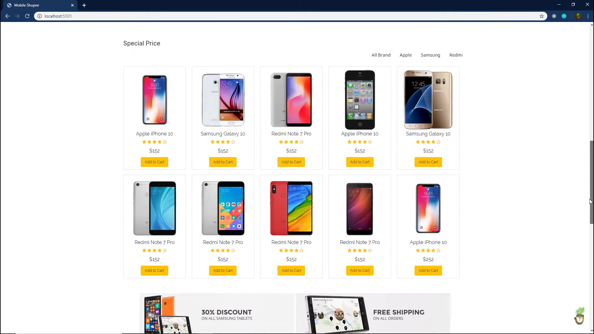
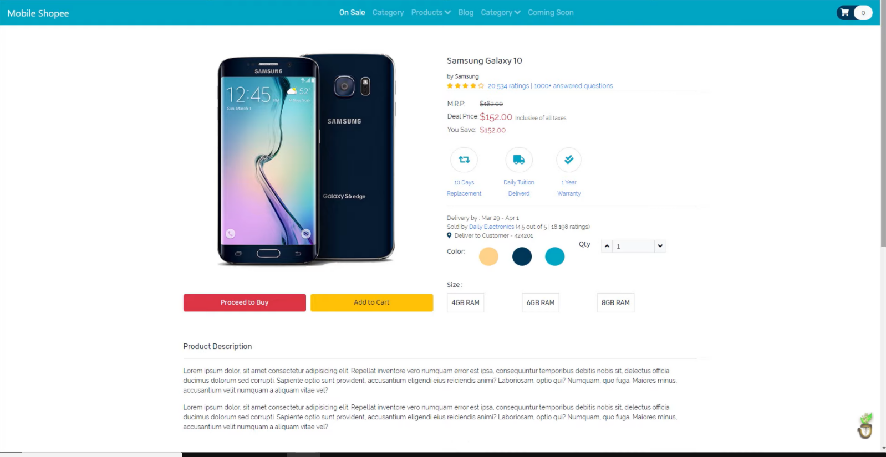
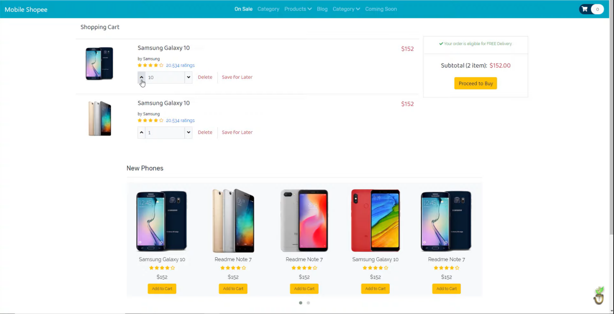

# Mobile shop
## A propos du site
Ce projet crée un site de commerce électronique de téléphones mobiles, en utilisant PHP et Mysql Database pour récupérer des produits et les afficher dans le projet.

## Utilisation
L'utilisateur peut voir les produites disponnible dans la page d'accueil: 

Il peut voir un produit :

il peut ajouter un produit au panier ou au whitelist:

## Bibliographie

https://openclassrooms.com/fr/courses/6391096-creez-des-sites-web-responsive-avec-bootstrap-4

https://openclassrooms.com/fr/courses/918836-concevez-votre-site-web-avec-php-et-mysql
